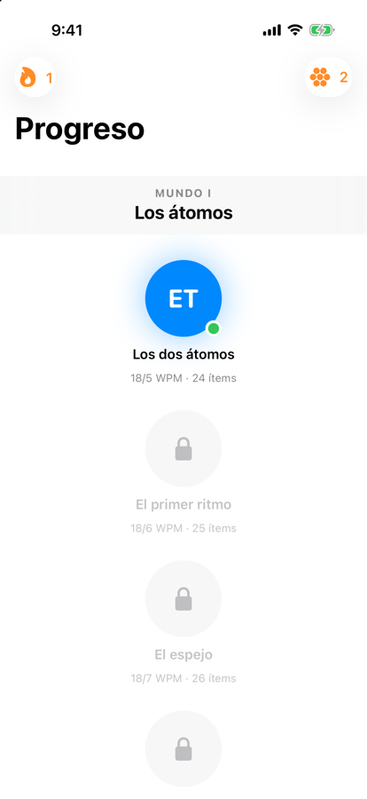
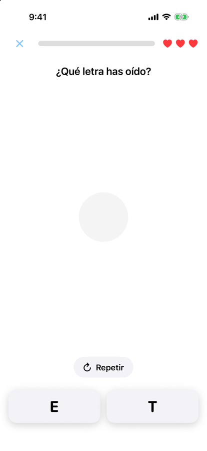
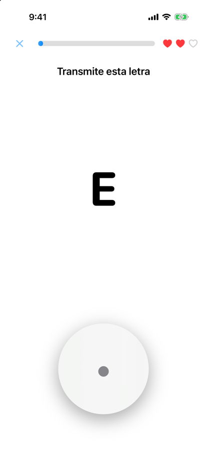

# MorseTrainer

[](https://github.com/sebasagua1/MorseTrainer/actions/workflows/ci.yml)

Entrenador de código Morse para iOS. Combina el rigor del **método Koch** con el
bucle corto de un juego: corazones, racha diaria, cobre y una progresión de 30
niveles que va de dos letras al alfabeto completo más los dígitos.

Escrito en SwiftUI y SwiftData, con Core Haptics y audio pre-renderizado.

| Mapa | Recepción | Transmisión |
|---|---|---|
|  |  |  |

## Las dos ideas que lo sostienen

**Koch.** Se empieza con dos caracteres a velocidad final y se añade uno nuevo
solo cuando los anteriores se reconocen al 90 %. Nunca se practica «despacio
para luego acelerar», porque el patrón lento se aprende como una cosa distinta
del rápido y hay que desaprenderlo.

**Farnsworth.** Los caracteres suenan siempre rápido (18–25 WPM) y lo que se
estira es el silencio entre ellos. Así la velocidad percibida es asumible desde
el primer minuto sin que el oído aprenda a *contar* elementos. El reparto del
retardo sigue la derivación de la ARRL: `PARIS ` son 50 unidades, 31 de
elementos y 19 de separación, repartidas 3/19 entre letras y 7/19 entre
palabras. Hay un test que lo comprueba al cuarto decimal.

El GDD pedía empezar por E y T. El Koch clásico arranca por K y M justamente
para evitarlas —son las más cortas y tientan a contar—, así que se respeta la
petición pero se compensa: la velocidad de carácter nunca baja de 18 WPM y desde
el nivel 2 entran caracteres de 2–3 elementos.

## Modos

| Modo | Qué mide |
|---|---|
| **Campaña** | 30 niveles, un carácter nuevo cada uno, con corazones y dominio |
| **Práctica libre** | Repaso sin corazones ni final. Sigue alimentando al motor adaptativo, así que practicar aquí cambia lo que sale en la campaña |
| **Contrarreloj** | 60 segundos, casi todo recepción. Cuántas letras reconoces sin pensar |
| **Supervivencia** | Tres corazones y la velocidad subiendo. Dónde está tu techo real |

Los tres modos libres se juegan sobre el alfabeto ya desbloqueado y no enseñan
caracteres nuevos. Supervivencia existe porque la campaña se detiene en cuanto
dominas un nivel y nunca llega a enseñarte dónde te rompes.

Internamente un nivel de campaña **es** una sesión más, no un caso especial:
`GameSession` describe qué la termina, si hay corazones, si la velocidad sube y
si cuenta para el progreso. El bucle de juego es uno solo.

## El motor adaptativo

Cada carácter tiene un peso en la cola que sube con el déficit de precisión, con
la novedad y con las confusiones registradas. Si respondes H cuando suena S,
**suben las dos**: el par entra junto y se contrasta, que es la única forma de
deshacer una confusión.

Tres detalles que no son obvios:

- **El teclado de respuesta no es aleatorio.** Los distractores salen de los
  caracteres que tú ya confundes con el objetivo. Un teclado al azar deja
  aprobar por descarte.
- **El historial se siembra encogido.** Un carácter con 200 intentos al 95 %
  tendría una media imposible de mover dentro de una sesión. Se siembra una
  versión que conserva la precisión pero no el volumen, así la historia informa
  la cola sin congelarla.
- **Los aciertos de hoy se cuentan aparte.** El requisito de «6 aciertos del
  carácter nuevo» se mide contra la sesión actual, nunca contra el acumulado:
  el historial informa, no aprueba el nivel por ti.

## Hardware de iOS

Una sola línea de tiempo (`[MorseEvent]`) alimenta los tres canales de salida,
cada uno con la técnica que le corresponde:

| Canal | Técnica | Por qué |
|---|---|---|
| Audio | búfer PCM pre-renderizado | exactitud de muestra: a 20 WPM un punto dura 60 ms y 10 ms de deriva ya deforman el ritmo |
| Háptica | un único `CHHapticPattern` | lo programa Core Haptics, no nuestro planificador: cero deriva frente al tono |
| Linterna | bucle con *deadlines* absolutos | el flash tarda ~5 ms en responder; más precisión no se nota |

El tono lleva una rampa de coseno elevado de 5 ms en cada flanco. Sin ella se
oye un clic de conmutación en cada punto, y a 20 WPM es insoportable.

La linterna es una alternativa completa al audio, no un extra: permite jugar en
silencio y sirve de canal principal para personas con pérdida auditiva.

## Estructura

```
Sources/
├── Core/        Modelo puro, sin SwiftUI. Se testea sin simulador.
│                MorseCode · LevelPlan · DrillScheduler · LessonModels
├── Services/    Efectos y hardware.
│                MorseTransmitter · MorseWaveformRenderer
│                TelegraphFeedback · PersistenceStore
└── Features/    ViewModels (@MainActor) y vistas.
                 Telegraph/ · Lesson/
App/             Punto de entrada y mapa de progresión.
Tests/           89 tests en 10 suites (Swift Testing).
```

`ARCHITECTURE.md` entra en el detalle de capas, persistencia y accesibilidad.

## Compilar y probar

Requiere Xcode 16 o posterior (el proyecto usa grupos sincronizados con el
sistema de archivos) e iOS 17 como objetivo mínimo.

```bash
open MorseTrainer.xcodeproj
```

```bash
xcodebuild test -project MorseTrainer.xcodeproj -scheme MorseTrainer -destination 'platform=iOS Simulator,name=iPhone 16'
```

Añadir un `.swift` dentro de `Sources/`, `App/` o `Tests/` lo incorpora al
target automáticamente: no hay que tocar el `project.pbxproj`.

## Versionado del esquema

Los modelos de SwiftData viven dentro de `MorseSchemaV1`, no sueltos en el
módulo, y el contenedor se abre a través de `MorseMigrationPlan`. Con una sola
versión el plan está vacío, y eso es justo lo que se quiere: añadir la V2 será
editar dos arrays en `Sources/Services/MorseSchema.swift`, en vez de reescribir
la construcción del contenedor con usuarios ya instalados.

El resto de la app usa `PlayerProfile`, `LetterRecord`… a través de alias, así
que publicar una versión nueva no toca ni una línea fuera de ese archivo. Hay un
test que falla si alguien añade una versión al plan y se olvida de la etapa de
migración correspondiente, que es el despiste que borra los datos de todo el
mundo.

## Distribución

El proyecto está listo para archivar: bundle ID `com.sebasagua.MorseTrainer`,
icono generado por código en `Scripts/make-icon.swift`, equipo de desarrollo y
declaración de cumplimiento de cifrado.

```bash
./Scripts/release.sh            # .ipa firmado para App Store Connect
./Scripts/release.sh --dev      # .ipa instalable en los dispositivos del equipo
./Scripts/release.sh --upload   # sube el build a TestFlight
```

El App ID, el certificado de distribución y el perfil de tienda ya están
creados. Queda un paso manual —crear el registro de la app en App Store
Connect, que Apple no permite automatizar— detallado en
[`docs/TESTFLIGHT.md`](docs/TESTFLIGHT.md).

## Estado

Funciona el bucle completo —mapa, recepción, transmisión, rondas de palabra,
corazones, racha y persistencia— verificado en simulador.

Lo que falta antes de que esto sea una app publicable:

- **Háptica y linterna sin probar en hardware.** El simulador no tiene Taptic
  Engine ni flash, así que esas rutas solo están verificadas a nivel de código.
- **Sin tienda ni cosméticos.** El cobre se gana y se acumula, pero todavía no
  se gasta en nada.
- **Sin récords por modo.** Contrarreloj y supervivencia no guardan tu mejor
  marca todavía, que es justo lo que los hace volver a jugarse.
- **Sin licencia.** Sin un archivo `LICENSE`, el código es «todos los derechos
  reservados» por defecto.
